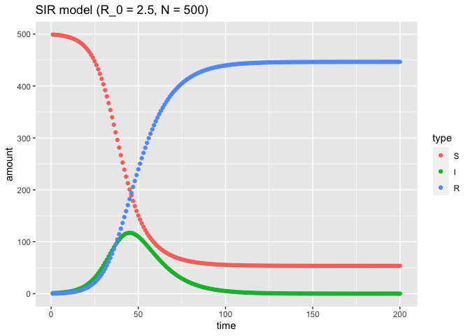
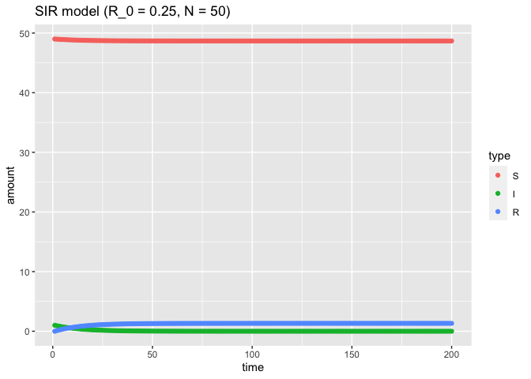
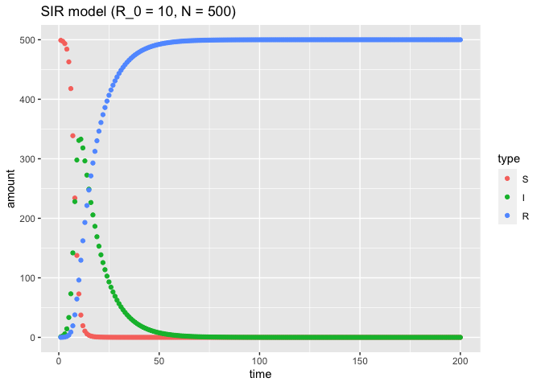
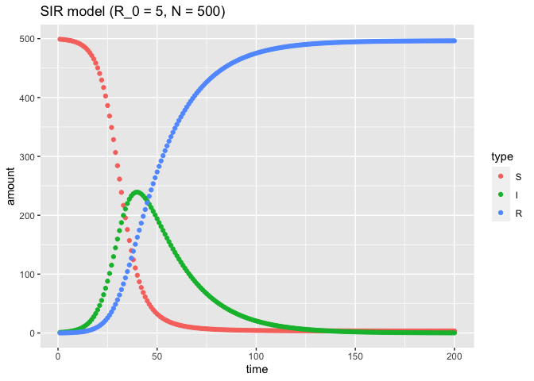
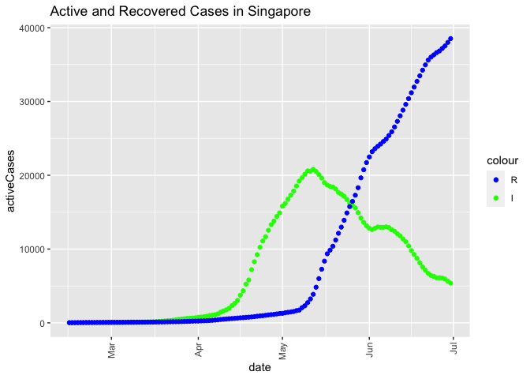
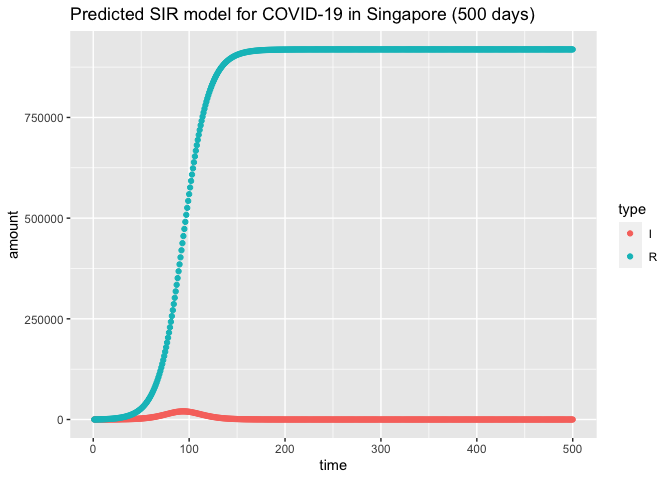
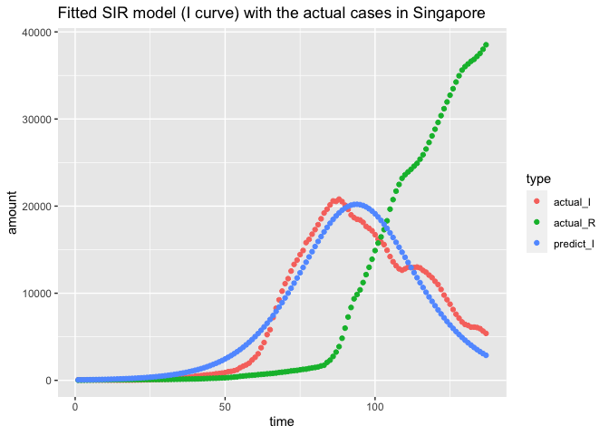

### Load Packages

```r
library(ggplot2)
library(deSolve)
library(tidyr)
library(minpack.lm)
```

## Task 1
__Numerically integrate the SIR model using the 4th order Runge-Kutta method, i.e., given $\beta$, $\gamma$ and N, find S(t), I(t), and R(t) for a given t.
Try it out for various values of $\beta$, $\gamma$ and N yourself and convince yourself (and me) that your code is correct.__

Define a function to solve SIR model using 4th order Runge-Kutta:

```r
rk4SIR <- function(N, gamma, beta, I0, n){
  S0 = N - I0 # initial number of suspecible population
  R0 = 0 # initial number of recovery cases
  # at t = 0, S = S0, I = I0, R = R0
  y0 <- c(S = S0, I = I0, R = R0)
  # define the time frame
  time <- 1:n
  # vector of parameters used for SIR model
  params <- c(beta = beta, gamma = gamma)
  
  # define SIR model
  SIR <- function(t, y, params){
  with(as.list(c(params, y)),{
    dSdt <- -beta * S * I
    dIdt <- beta * S * I - gamma * I
    dRdt <- gamma * I
    list(c(dSdt, dIdt, dRdt))
  })
  }
  # use 4th order Runge-Kutta to solve SIR model
  output <- rk4(y0, time, SIR, params)
  # convert the output to dataframe
  df <- data.frame(output)
  # convert df from wide data to long
  df <- gather(df, type, amount, S:R, factor_key = TRUE)
  return(df)
}
```

### Scenario 1 - N = 500

Set the constants:

```r
N = 500 # total population
I0 = 1 # intial infected case(s)
beta = 0.0005 # infection rate
gamma = 0.1 # recovery rate
n = 200 # range of time

# calculate basic reproduction number R_0
R_0 = beta * N / gamma
print(paste0('Basic Reproduction Number: ', R_0))
```

```
## [1] "Basic Reproduction Number: 2.5"
```

Insert the parameters to build the SIR model with N = 500, $\beta = 0.0005$, and $\gamma = 0.1$: 

```r
df1 <- rk4SIR(N, gamma, beta, I0, n)
```

Plot the change of S, I, R with time

```r
ggplot(df1, aes(x = time, y = amount, color = type, group = type)) + 
  geom_point() + ggtitle('SIR model (R_0 = 2.5, N = 500)')
```

<!-- -->

### Scenario 2 - N = 50

Change the population (N) to 50 , while the rest of the parameters remain unchanged from `Scenario 1`:

```r
# calculate basic reproduction number R_0
R_0 = beta * 50 / gamma
print(paste0('Basic Reproduction Number: ', R_0))
```

```
## [1] "Basic Reproduction Number: 0.25"
```

```r
# build the model with new parameters
df2 <- rk4SIR(50, gamma, beta, I0, n)
```

Plot the change of S, I, R with time:

```r
ggplot(df2, aes(x = time, y = amount, color = type, group = type)) + 
  geom_point() + ggtitle('SIR model (R_0 = 0.25, N = 50)')
```

<!-- -->

Comparing `scenario 1` and `scenario 2`, it can be found that with the same infection rate and recovery rate, $R_0$ (basic reproduction number) changes with population size. With a smaller population, the disease is less likely to become a pandemic (shown by scenario 2) comparing to a larger population scenario (scenario 1).

### Scenario 3 - Large $\beta$

Increase $\beta$ while all other parameters are the same as `Scenario 1`.


```r
R_0 = 0.002 * N / gamma
print(paste0('Basic Reproduction Number: ', R_0))
```

```
## [1] "Basic Reproduction Number: 10"
```

```r
# build the model with new parameters
df3 <- rk4SIR(N, gamma, 0.002, I0, n)
```

Plot the changes of S, I, R with time:

```r
ggplot(df3, aes(x = time, y = amount, color = type, group = type)) + 
  geom_point() + ggtitle('SIR model (R_0 = 10, N = 500)')
```

<!-- -->

Comparing to `Scenario 1`, with a larger $\beta$, the disease spreads much faster, where the number of susceptible cases dropped to almost 0 within 20 units of time. However, with a relatively high recovery rate, the infected patients are recovered at a faster rate as well. The peak number of infected cases occurs early in stage (~ 10 units of time). Eventually, the disease dies out around 50 units of time, which is much faster than `scenario 1` (where the disease dies out around 100 units of time).

### Scenario 4 - Small $\gamma$

Decrease $\gamma$ while all other parameters are the same as `Scenario 1`.


```r
R_0 = beta * N / 0.05
print(paste0('Basic Reproduction Number: ', R_0))
```

```
## [1] "Basic Reproduction Number: 5"
```

```r
# build the model with new parameters
df4 <- rk4SIR(N, 0.05, beta, I0, n)
```

Plot the changes of S, I, R with time:

```r
ggplot(df4, aes(x = time, y = amount, color = type, group = type)) + 
  geom_point() + ggtitle('SIR model (R_0 = 5, N = 500)')
```

<!-- -->

Comparing to `Scenario 1`, with a lower recovery rate, the disease takes more time to die out (~ 120 units of time). Besides, the peak number of infected cases is higher than that in `Scenario 1`. Moreover, all population has been infected before the disease dies out, whereas with a higher recovery rate in `Scenario 1`, the patients are recovered faster, leading to part of the population un-infected when the disease dies out.

## Task 2
__Compile and plot the number of COVID-19 cases in Singapore for the period Feb. 15, 2020 to Jun. 30, 2020 from the website https://www.worldometers.info/coronavirus/country/singapore/. Compare the trend with the predictions from the SIR model. Explain why it agrees or disagrees.__

The number of cumulative COVID-19 cases and the cumulative recovery cases in Singapore within the timeframe has been compiled in file 'covid_sg.csv'. _(Some data points were obtained from https://data.world/hxchua/covid-19-singapore due to the incompleteness of data from the link above)._

Import the compiled data on SG covid-19 cases:

```r
df_sg <- read.csv('covid_sg.csv')
df_sg$date <- as.Date(df_sg$date, '%d/%m/%y')
```

Plot the active cases in Singapore within the timeframe required:

```r
Legend = c('R' = 'blue', 'I' = 'green')
ggplot(df_sg, aes(x = date)) + geom_point(aes(y = activeCases, color = 'I')) +
  geom_point(aes(y = recovered, color = 'R')) + ggtitle('Active and Recovered Cases in Singapore') + theme(axis.text.x = element_text(angle = 90, vjust = 0.5, hjust = 1)) + 
  scale_color_manual(values = Legend)
```

<!-- -->

Knowing the changes of infected cases and recovered cases, find the parameters of SIR model that best fit the COVID-19 trend in Singapore from 15-Feb-2020 to 30-Jun-2020. In other word, the problem now is to find the optimum `N`, `$\beta$`, and `$\gamma$`. Noted that `N` should be less than 5.7 million (population of Singapore).

```r
# set the initial condition on 15-Feb-20
I0 <- 54
R0 <- 18

# initial parameters to start with
N <- 5700000
beta <- 0.000000005
gamma <- 0.08
# define initial state
y0 <- c(S = N - I0, I = I0, R = R0)

time <- 1:137 # set timeframe same length as actual data

# define SIR model
SIR <- function(t, y, parm){
  # vector of parameters used in SIR model
  with(as.list(c(parm, y)),{
    dSdt <- -beta * S * I 
    dIdt <- beta * S * I - gamma * I
    dRdt <- gamma * I
    list(c(dSdt, dIdt, dRdt))
  })
}

# define a function to calculate the residuals (between prediction and actual)
sqrt_residual <- function(par){
  params <- c(beta = par[1], gamma = par[2], N = par[3]) 

  # prediction
  y <- data.frame(rk4(y0, time, SIR, params))
  
  # residuals
  res <- df_sg$activeCases - y$I # based on I curve
  # res <- y$R - df_sg$R # based on R curve
  return(res)
}

# find the optimum parameters by minimizing the sum square of residuals with The Levenberg-Marquardt Algorithm
# The Levenberg-Marquardt Algorithm is used to solve non-linear least squares curve fitting.
fitval <- nls.lm(par=c(beta, gamma, N),fn=sqrt_residual, control = nls.lm.control(nprint=1) )
```

```
## It.    0, RSS = 1.45711e+10, Par. =      5e-09       0.08    5.7e+06
## It.    1, RSS = 1.45459e+10, Par. =  8.16201e-09  0.0619768    5.7e+06
## It.    2, RSS = 1.44832e+10, Par. =  9.32992e-09  0.0553199    5.7e+06
## It.    3, RSS = 1.43758e+10, Par. =  1.00592e-08  0.0511629    5.7e+06
## It.    4, RSS = 1.41867e+10, Par. =  1.06652e-08  0.0477095    5.7e+06
## It.    5, RSS = 1.38568e+10, Par. =  1.12127e-08  0.0445891    5.7e+06
## It.    6, RSS = 1.33004e+10, Par. =  1.17219e-08  0.0416875    5.7e+06
## It.    7, RSS = 1.24356e+10, Par. =  1.21938e-08  0.0389984    5.7e+06
## It.    8, RSS = 1.11048e+10, Par. =  1.26816e-08    0.03622    5.7e+06
## It.    9, RSS = 9.82438e+09, Par. =  1.31709e-08   0.033435    5.7e+06
## It.   10, RSS = 9.77101e+09, Par. =  1.37506e-08  0.0355971    5.7e+06
## It.   11, RSS = 9.7671e+09, Par. =  1.45845e-08  0.0405264    5.7e+06
## It.   12, RSS = 9.76251e+09, Par. =  1.63239e-08  0.0504062    5.7e+06
## It.   13, RSS = 9.75181e+09, Par. =  1.98003e-08  0.0701799    5.7e+06
## It.   14, RSS = 9.72397e+09, Par. =  2.67551e-08   0.109716    5.7e+06
## It.   15, RSS = 9.64176e+09, Par. =  4.06717e-08   0.188748    5.7e+06
## It.   16, RSS = 9.36296e+09, Par. =  6.85344e-08   0.346644    5.7e+06
## It.   17, RSS = 8.29933e+09, Par. =  1.244e-07   0.661634    5.7e+06
## It.   18, RSS = 6.17236e+09, Par. =  2.3706e-07    1.28623    5.7e+06
## It.   19, RSS = 5.87816e+09, Par. =  2.16256e-07    1.13471    5.7e+06
## It.   20, RSS = 2.26577e+09, Par. =  2.02005e-07    1.07536    5.7e+06
## It.   21, RSS = 6.22439e+08, Par. =  1.7824e-07   0.935154    5.7e+06
## It.   22, RSS = 3.79358e+08, Par. =  1.67132e-07   0.873458    5.7e+06
## It.   23, RSS = 3.79006e+08, Par. =  1.67344e-07   0.874766    5.7e+06
## It.   24, RSS = 3.79004e+08, Par. =  1.6733e-07   0.874694    5.7e+06
## It.   25, RSS = 3.79004e+08, Par. =  1.67328e-07   0.874683    5.7e+06
## It.   26, RSS = 3.79004e+08, Par. =  1.67327e-07   0.874681    5.7e+06
```

```r
fitval
```

```
## Nonlinear regression via the Levenberg-Marquardt algorithm
## parameter estimates: 1.67327290335252e-07, 0.874680859073623, 5700000 
## residual sum-of-squares: 3.79e+08
## reason terminated: Relative error in the sum of squares is at most `ftol'.
```

The Levenberg-Marquardt Algorithm is used to solve non-linear least squares curve fitting, interpolating between Gaus-Newton algorithm and gradient descent. The output of the algorithms might only be a local minimum, which may or may not equal to the global minimum.

Retrieve the optimum parameters found and plot the predicted curves of `I` and `R`:

```r
# retrieve the parameters
beta <- fitval$par[1]
gamma <- fitval$par[2]
N <- fitval$par[3]

# plot the curve of I, R
df_pred <- rk4SIR(N, gamma, beta, I0, 500)
ggplot(df_pred[df_pred$type != 'S',], aes(x = time, y = amount, color = type, group = type)) + 
  geom_point() + ggtitle('Predicted SIR model for COVID-19 in Singapore (500 days)') 
```

<!-- -->

Plot the predicted curve and the actual curve on the same plot:

```r
# get the predicted cases within the same timeframe of 137 days
df_pred <- rk4SIR(N, gamma, beta, I0, 137)
df_pred <- df_pred[df_pred$type != 'S',] # exclude susceptible cases
df_pred$type <- ifelse(df_pred$type == 'I', 'predict_I', 'predict_R')
colnames(df_sg) <- c('time', 'actual_I', 'actual_R')
df_sg_long <- gather(df_sg, type, amount, actual_I:actual_R, factor_key = TRUE) # transform the wide dataframe to long
df_sg_long$time <- rep(1:137, 2) # unify the date indicator between predication and actual dataframe

df_plot <- rbind(df_sg_long, df_pred) # merge the predication and actual dataframe
ggplot(df_plot[df_plot$type != 'predict_R',], aes(x = time, y = amount, color = type, group = type)) + geom_point() + ggtitle('Fitted SIR model (I curve) with the actual cases in Singapore')
```

<!-- -->

The plot above shows the predicted `I` curve, the actual `I` curve and actual `R` curve, where the predicted `I` curve is a good fit of the actual scenario. However, with the same parameters, the predicted `R` curve is significantly higher than the actual cases (shown in graph 'Predicted SIR model for COVID-19 in Singapore (500 days)'). This is not surprising as the parameters were found by minimizing the squared residual of `I` instead of `R`.

From the estimated parameters, the basic reproduction number ($R_0$) is roughly 1.09.

```r
# calculate R_0
beta * N / gamma
```

```
## [1] 1.090415
```

Comparing to the predicted SIR model:

- The actual number of infected cases shared the similar trend of change with more fluctuations, where a minor peak of infected cases was observed around early June. This corresponded to the end of circuit breaker, when community interaction increased comparing to the previous few months.

- The basic reproduction number (1.09) indicates the low likelihood of COVID-19 turning into a pandemics. This is obviously not true, as the predicted R-curve is not well fitted to the actual scenario and is much higher than the actual value. In other word, the actual recovery rate could be much lower than predicted, leading to the pandemic. Also, $R_0$ was calculated with $N = 5.7 million$, which is not accurate due to the different probability of infection among population (see next point).

- The simplified SIR model assumes that all infected cases are evenly distributed geographically, and each susceptible case has the same possibility to be infected. However, this is very less likely to true in real world scenarios. For example, majority of the COVID-19 cases in Singapore were found in foreign worker camps, and controls have been implemented soon after to limit the interactions between foreign workers and the community. Also, due to the circuit breaker, the vast majority of population were quarantined at home from April to June with a lower possibility of infection comparing to front-line workers. All these factors affects the actual number of cases and were not well considered in the simplified SIR model.

