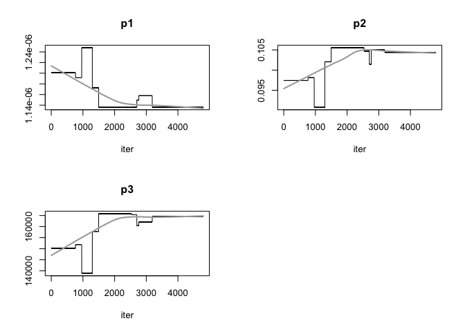
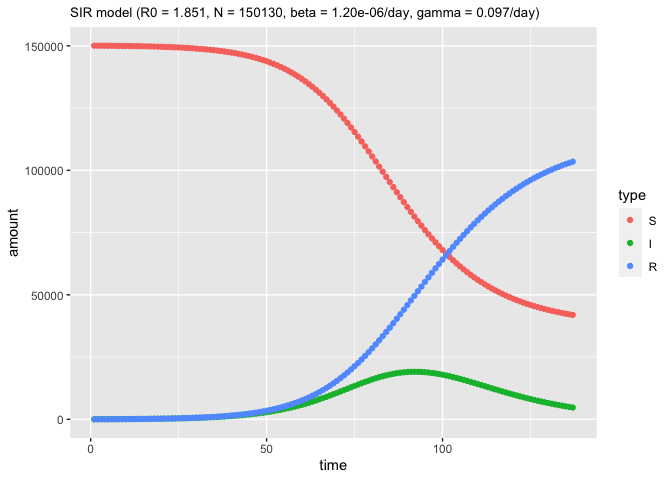
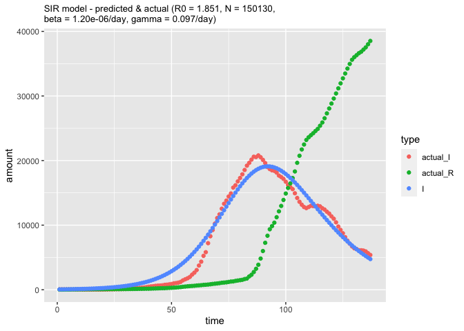
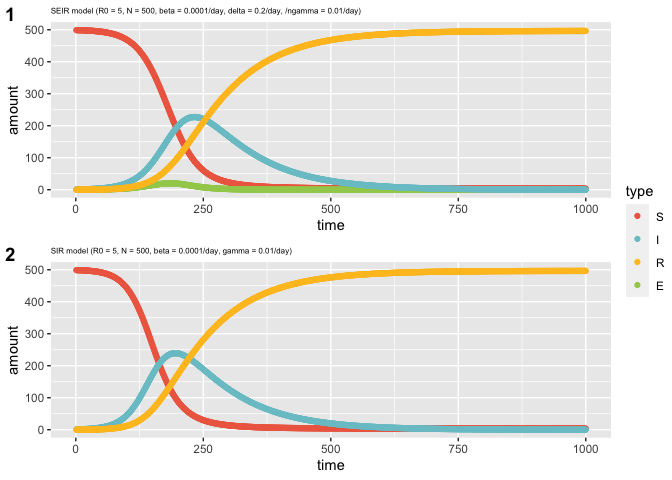
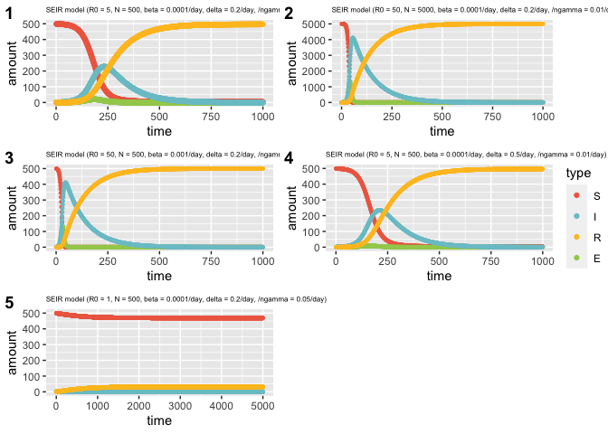

```r
library(ggplot2)
library(ggpubr)
library(deSolve)
library(tidyr)
library(FME)
```

# Task 1
__Estimate the basic reproduction number, $R_0$, from the SIR model for the data you collected in Homework 1. Explain and justify your choice of optimization technique used.__

Load the data collected in Homework 1 for COVID-19 active cases and recovered cases in Singapore:

```{.r .fold-show}
df_sg <- read.csv('covid_sg.csv')
df_sg$time <- c(1:137)
colnames(df_sg) <- c('date', 'I', 'R', 'time')
df_sg <- df_sg[,c(2:4)] # drop date column
```

As the function of `I` could not be written out explicitly, it is impossible to get the gradient of I. Hence, gradient free method should be used to estimate the parameters of the model. Apply __Markov Chain Monte Carlo__ algorithm to find the optimum parameter of SIR model based on COVID-19 cases in Singapore. The algorithm (following the Metropolis algorithm) starts with a guess of the initial parameters, calculate the likelihood of the parameters based on the data points given (i.e. df_sg) and make a second guess of the parameters from a normal distribution centered at the first guess. The likelihood of the 2nd set of parameters is compared against the first one to calculate a ratio. If the ratio is greater than a randomly picked number from uniform distribution of U(0,1), then the 2nd set of parameters are accepted. The same process iterates for a fixed number of times.


```{.r .fold-show}
set.seed(127)
# set the initial condition on 15-Feb-20
Ii <- 54
Ri <- 18
# initial parameters to start with (random guess)
N <- 5700000 # population of SG
beta <- 0.0000005
gamma <- 0.3
time <- 1:137 # set timeframe same length as actual data

# define SIR model solved by 4th order Runge-Kutta
rk4SIR <- function(N, gamma, beta, Ii, n){
  Si = N - Ii # initial number of suspecible population
  Ri = 0 # initial number of recovery cases
  # at t = 0, S = Si, I = Ii, R = Ri
  yi <- c(S = Si, I = Ii, R = Ri)
  # define the time frame
  time <- 1:n
  # vector of parameters used for SIR model
  params <- c(beta = beta, gamma = gamma)
  
  # define SIR model
  SIR <- function(t, y, params){
  with(as.list(c(params, y)),{
    dSdt <- -beta * S * I
    dIdt <- beta * S * I - gamma * I
    dRdt <- gamma * I
    list(c(dSdt, dIdt, dRdt))
  })
  }
  # use 4th order Runge-Kutta to solve SIR model
  output <- rk(yi, time, SIR, params, method = 'rk4', hini = 0.1)
  # convert the output to dataframe
  df <- data.frame(output)
  return(df)
}

# define the residual of infected cases (curve fitting based on I curve)
res <- function(p){
  beta = p[1]
  gamma = p[2]
  N = p[3]
  df_sg$I - rk4SIR(N, gamma, beta, Ii, 137)$I
}

# use modFit to refine the initial parameters and calculate the corresponding variance
par <- modFit(f = res, p = c(beta, gamma, N))

sum_par <- summary(par)
s2prior = sum_par$modVariance # obtain initial variance

# use MCMC (DRAM) to find the optimum beta, gamma, N with 5000 iterations, parameter covariance is updated every 75 iterations
# the initial parameters are refined by modFit
MCMC <- modMCMC(f = res, p = par$par, lower = rep(0, 3), upper = c(1, 1, 5700000), niter = 5000, 
                updatecov = 75,  burninlength = 200, var0 = s2prior)
```

```
## number of accepted runs: 8 out of 5000 (0.16%)
```

The acceptance rate is low, indicating the model takes longer and more iterations to converge.

Check the convergence of the parameters (p1 - $\beta$, p2 - $\gamma$, p3 - N)

```{.r .fold-show}
plot(MCMC)
```

<!-- -->

Plot the SIR model with the parameters found

```{.r .fold-show}
# assign the optimum parameters
beta = MCMC$bestpar[1]
gamma = MCMC$bestpar[2]
N = MCMC$bestpar[3]
# calculate R0
R0 = round(beta * N / gamma,3)
print(paste0('Basic Reproduction Number: ', R0))
```

```
## [1] "Basic Reproduction Number: 1.851"
```

```{.r .fold-show}
# plot the SIR model with optimum parameters that fit COVID-19 Infected cases in Singapore
df_mcmc <- gather(rk4SIR(N, gamma, beta, Ii, 137), type, amount, S:R, factor_key = TRUE)
ggplot(df_mcmc, aes(x = time, y = amount, color = type, group = type)) + 
  geom_point() + ggtitle('SIR model (R0 = 1.851, N = 150130, beta = 1.20e-06/day, gamma = 0.097/day)') + theme(plot.title = element_text(size = 10)) 
```

<!-- -->

Plot the prediction and actual cases in Singapore on the same plot:

```r
df_sg_m <- gather(df_sg, type, amount, I:R, factor_key = TRUE)
df_sg_m$type <- ifelse(df_sg_m$type == 'I', 'actual_I', ifelse(df_sg_m$type == 'R', 'actual_R', 'actual_S'))
df_sg_m <- df_sg_m[df_sg_m$type != 'actual_S',]
df_all <- rbind(df_sg_m, df_mcmc)

ggplot(df_all[!(df_all$type %in% c('R', 'S')),], aes(x = time, y = amount, color = type, group = type)) + 
  geom_point() + ggtitle('SIR model - predicted & actual (R0 = 1.851, N = 150130, \nbeta = 1.20e-06/day, gamma = 0.097/day)') + theme(plot.title = element_text(size = 10)) 
```

<!-- -->

The predicted `I` curve shows a good fit to the actual data points. However, the predicated `R` curve calculated from the same set of parameters are way higher than the actual curve. 
This is because the parameters were found by minimizing the `I` curve residuals. Future improvement could be done to find the optimum parameters by fitting both `I` and `R` curves.

The predicted N is only 150 130, much lower than the total population of Singapore. It makes sense as not all Singapore residence has the same probability of infection due to the geographical and social-economical distributions. Hence, N is smaller than the total population.

----

# Task 2
__The SUSCEPTIBLE-EXPOSED-INFECTED-RECOVERED (SEIR) model incorporates an EXPOSED compartment to model persons who have been exposed to the disease but are not yet contagious:__


__Write down the set of 4 ordinary differential equations for this model. Solve them numerically using the 4th-order Runge-Kutta method.__

The SEIR model can be written as below:
$$
\begin{aligned}
\frac{dS}{dt} &= -\beta S I \\
\frac{dE}{dt} &= \beta S I - \delta E \\
\frac{dI}{dt} &= \delta E - \gamma I \\
\frac{dR}{dt} &= \gamma I
\end{aligned}
$$

Define a function to solve SEIR model using 4th order Runge-Kutta:

```{.r .fold-show}
rk4SEIR <- function(N, gamma, beta, delta, Ii, n){
  Si = N - Ii # initial number of suspecible population
  Ri = 0 # initial number of recovery cases
  Ei = 0 # initial number of exposed cases
  # at t = 0, S = Si, E = Ei, I = Ii, R = Ri
  yi <- c(S = Si, E = Ei, I = Ii, R = Ri)
  # define the time frame
  time <- 1:n
  # vector of parameters used for SIR model
  params <- c(beta = beta, gamma = gamma, delta = delta)
  
  # define SEIR model
  SEIR <- function(t, y, params){
  with(as.list(c(params, y)),{
    dSdt <- -beta * S * I
    dEdt <- beta * S * I - delta * E
    dIdt <- delta * E - gamma * I
    dRdt <- gamma * I
    list(c(dSdt, dEdt, dIdt, dRdt))
  })
  }
  # use 4th order Runge-Kutta to solve SIR model
  output <- rk(yi, time, SEIR, params, method = 'rk4', hini = 0.1)
  # convert the output to dataframe
  df <- data.frame(output)
  # convert df from wide data to long
  df <- gather(df, type, amount, S:R, factor_key = TRUE)
  return(df)
}
```

When $N = 500, \beta = 0.0001/day, \delta = 0.2/day, \gamma = 0.01/day$, the SEIR model and SIR model can be plotted as:

```r
N = 500
beta = 0.0001
delta = 0.2
gamma = 0.01
df1 <- rk4SEIR(N, gamma, beta, delta, 1, 1000) # 1 infected cases initially
df1_sir <- gather(rk4SIR(N, gamma, beta, 1, 1000), type, amount, S:R)  # 1 infected cases initially

R0 = beta * N / gamma
print(R0)
```

```
## [1] 5
```

```r
col = list('S' = 'coral2', 'I' = 'cadetblue3', 'R' = 'goldenrod1', 'E' = 'darkolivegreen3')

p_seir <- ggplot(df1, aes(x = time, y = amount, color = type, group = type)) + 
  geom_point() + ggtitle('SEIR model (R0 = 5, N = 500, beta = 0.0001/day, delta = 0.2/day, /ngamma = 0.01/day)') + theme(plot.title = element_text(size = 6)) +
  scale_color_manual(values = col)
p_sir <- ggplot(df1_sir, aes(x = time, y = amount, color = type, group = type)) + 
  geom_point() + ggtitle('SIR model (R0 = 5, N = 500, beta = 0.0001/day, gamma = 0.01/day)') + theme(plot.title = element_text(size = 6))+
  scale_color_manual(values = col)

ggarrange(p_seir, p_sir, labels = c(1,2), ncol = 1, nrow = 2, common.legend = TRUE, legend = 'right')
```

<!-- -->

As observed, with the same value of $R_0$, `I` curve in SEIR model reaches its peak later than `I` curve in SIR model, which could be due to the introduction of `Exposed` component, leading to longer time for patients to become infected from exposed.

Altering the parameters of SEIR model, the curve changes as below:


```{.r .fold-show}
# calculate output of SEIR with different paramters
df_N <- rk4SEIR(5000, gamma, beta, delta, 1, 1000)
df_beta <- rk4SEIR(N, gamma, 0.001, delta, 1, 1000)
df_delta <- rk4SEIR(N, gamma, beta, 0.5, 1, 1000)
df_gamma <- rk4SEIR(N, 0.05, beta, delta, 1, 5000)

# calculate the corresponding R0
R0_N = round(beta * 5000 / gamma, 3)
R0_beta = round(0.001 * N / gamma, 3)
R0_delta = round(beta * N / gamma, 3)
R0_gamma = round(beta * N / 0.05, 3)
print(c(R0_N, R0_beta, R0_delta, R0_gamma))
```

```
## [1] 50 50  5  1
```


```r
p1 <- ggplot(df_N, aes(x = time, y = amount, color = type, group = type)) + 
  geom_point(size = 1) + ggtitle('SEIR model (R0 = 50, N = 5000, beta = 0.0001/day, delta = 0.2/day, /ngamma = 0.01/day)') + theme(plot.title = element_text(size = 6)) + scale_color_manual(values = col)
p2 <- ggplot(df_beta, aes(x = time, y = amount, color = type, group = type)) + 
  geom_point(size = 1) + ggtitle('SEIR model (R0 = 50, N = 500, beta = 0.001/day, delta = 0.2/day, /ngamma = 0.01/day)') + theme(plot.title = element_text(size = 6)) + scale_color_manual(values = col)
p3 <- ggplot(df_delta, aes(x = time, y = amount, color = type, group = type)) + 
  geom_point(size = 1) + ggtitle('SEIR model (R0 = 5, N = 500, beta = 0.0001/day, delta = 0.5/day, /ngamma = 0.01/day)') + theme(plot.title = element_text(size = 6)) + scale_color_manual(values = col)
p4 <- ggplot(df_gamma, aes(x = time, y = amount, color = type, group = type)) + 
  geom_point(size = 1) + ggtitle('SEIR model (R0 = 1, N = 500, beta = 0.0001/day, delta = 0.2/day, /ngamma = 0.05/day)') + theme(plot.title = element_text(size = 6)) + scale_color_manual(values = col)

ggarrange(p_seir, p1, p2, p3, p4, labels = c(1,2,3,4,5), ncol = 2, nrow = 3, common.legend = TRUE, legend = 'right')
```

<!-- -->

With the same $\beta$ and $\gamma$, SEIR curves vary with different N and different $\delta$ (see figure 2 & 4). 

----

# Task 3
__Compare your SEIR results to the SIR results. Explain which model you think is a better model for COVID-19 and why.__

SEIR model is a better model for COVID-19. Because in general, COVID-19 patients only become infectious after the incubation period of 5~6 days. This is well captured by the `Exposed` element in SEIR model, whereas in SIR model, all patients infected are considered to be infectious immediately after getting infected. Besides, the `I` curve in SEIR model peaks later than that in SIR model, which resembles more of the real situation, with incubation period taken into consideration.

-----

# Task 4
__Explain the meaning of the parameter $\delta$. Search published data to estimate the value of $\delta$.__

$\delta$ is the average rate of exposed patients becoming infectious. It has the unit of inverse time (e.g. /day). In other word, if in general, patients become infectious x days after getting infected, $\delta = frac{1}{x}$. It is also known as the incubation rate. The incubation period of COVID-19 is reported to be 5~6 days on average, however, it can be up to 14 days [1, 2]. Hence, $\delta$ can be calculated as 0.167/day ~ 0.20/day, with the lowest of 0.071/day.

----

# Task 5
__Herd immunity is achieved when 1 infected person infects <1 person on average. Show that, for herd immunity to occur, the fraction of the population that is immune, p, satisfies $p > 1 - \frac{1}{R_0}$. Based on your estimate of $R_0$, does your estimate of p agree with many governments’ vaccination target of 70%?__

By definition of $R_0$, it is the average number of new transmitted cases caused by single infected patients. Taking definition of herd immunity into consideration:
$$
\begin{aligned}
R_0 S &< 1 \\
R_0 (1-p) &< 1 \\
1-p &< \frac{1}{R_0} \\
p &> 1- \frac{1}{R_0}
\end{aligned}
$$

$R_0$ was calculated to be 1.851 from Task 1. Hence, p must be larger than 45.98%. This is lower than the 70% threshold reported on media. As $R_0$ varies from country to country, different threshold might be applied as well. The 70% reported was mostly found to be either for western countries like U.S. or for the general public as cited by WHO. 

```{.r .fold-show}
round(1-1/1.851, 4)
```

```
## [1] 0.4598
```

Besides, R0 also changes with time, hence, a constant figure of 70% may not reflect the actual herd immunity threshold required, taking into consideration of the changes of new cases reported. In addition, p here refers to all immune population. The immunity might be gained from infection or vaccination. Hence, the vaccination target is lower than the p calculated, especially for countries with more historical infected cases.

----

## _Reference_
[1] Yu P, Zhu J, Zhang Z, Han Y. A Familial Cluster of Infection Associated With the 2019 Novel Coronavirus Indicating Possible Person-to-Person Transmission During the Incubation Period. J Infect Dis. 2020;221(11):1757-61.

[2] Lauer SA, Grantz KH, Bi Q, Jones FK, Zheng Q, Meredith HR, et al. The Incubation Period of Coronavirus Disease 2019 (COVID-19) From Publicly Reported Confirmed Cases: Estimation and Application. Ann Int Med. 2020;172:577-82.
